# 🛡️ SafetyTrack – Smart Journey Safety Application

- SafetyTrack is a real-time Android journey safety application.
- It automatically shares live location via SMS at regular intervals.
- It sends emergency alerts using SOS and voice-based detection.
- Designed to enhance personal safety during travel.

---

# 📖 About the Project

- SafetyTrack ensures continuous GPS tracking during a journey.
- Location updates are sent every 2 minutes to selected emergency contacts.
- The app works even without internet using GPS and SMS services.
- It also provides instant SOS and voice-triggered alerts.

---

# 🚀 Core Features

## 🔐 User Authentication
- User Registration (Sign Up)
- Secure Login (Sign In)
- Email OTP Password Reset
- Mobile Number OTP Reset
- Auto-login functionality
- Firebase Firestore integration

## 📍 Real-Time Location Tracking
- GPS tracking using Fused Location Provider
- Generates Google Maps link
- Sends updates every 2 minutes
- Works offline (GPS + SMS)

## 📲 Automatic SMS Alerts
- Location sent when "Start Journey" is clicked
- SMS sent every 2 minutes
- Safe Arrival notification
- Stop Journey stops automatic alerts
- SMS delivered directly to recipient inbox

## 🚨 SOS Emergency Alert
- Instant HIGH ALERT message
- Includes current location
- Immediate SMS dispatch

## 🎤 Voice-Based Emergency Detection
- Detects keywords:
  - Help
  - Danger
  - Emergency
- Automatically triggers emergency SMS
- Uses Android SpeechRecognizer API

## 👥 Emergency Contact Management
- Contact Picker integration
- Multiple contact selection
- Displays number of selected contacts
- Used for alert notifications

---

# 🏗️ Tech Stack

- Language: Java
- IDE: Android Studio
- Database: Firebase Firestore
- Authentication: Firebase Auth
- Location Services: Fused Location Provider API
- SMS Service: Android SmsManager
- Speech Recognition: Android SpeechRecognizer API
- UI Design: XML Layouts

---

# 📱 Application Flow

- User installs the app
- Registers account
- Logs in
- Dashboard opens
- Select emergency contacts
- Click "Start Journey"
- Location sent every 2 minutes via SMS

- User can click:
  - Safe Arrival
  - Stop Journey
  - SOS Button
  - Voice Trigger Alert

- If already logged in, dashboard opens directly.

---

# 🔄 System Architecture

- Authentication Module
- Location Tracking Module
- SMS Alert Module
- Voice Detection Module
- Dashboard Controller
- Contact Management Module
- All modules integrate through the main dashboard activity

---

# 📡 Offline Capability

- GPS Location ✅ Yes
- SMS Alerts ✅ Yes
- WhatsApp Sharing ❌ Requires Internet

---

# 📸 Application Screenshots

## 🔐 Authentication

### Login Page

### Create New Account
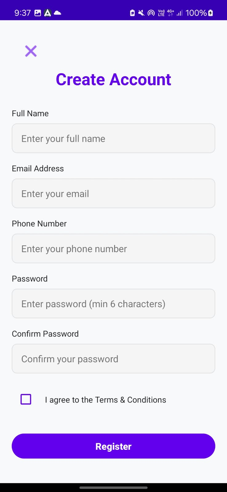

### Reset Password via Email
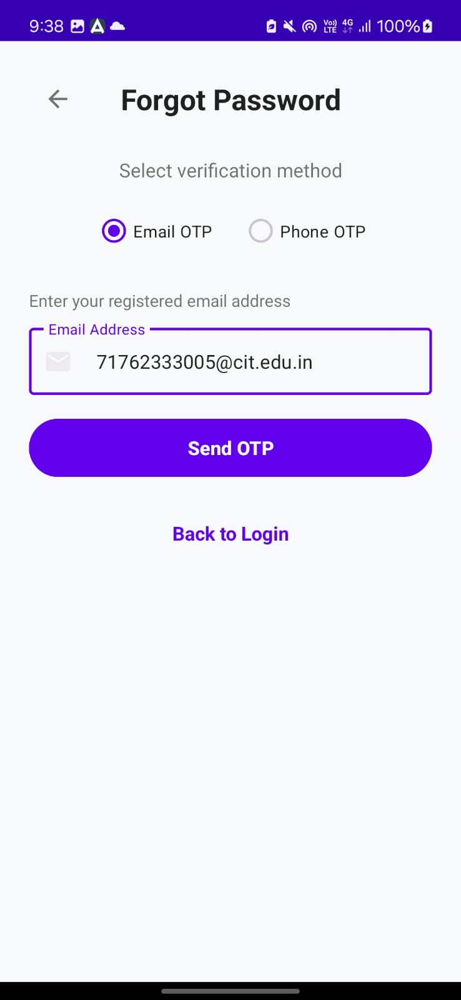

### Reset Password via Phone Number
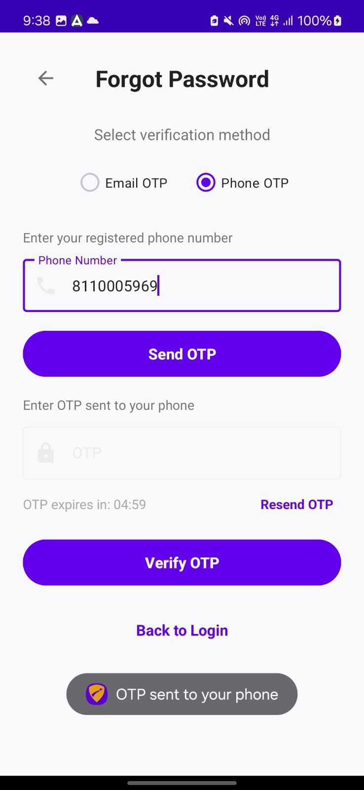

---

## 🏠 Dashboard & Journey

### Dashboard
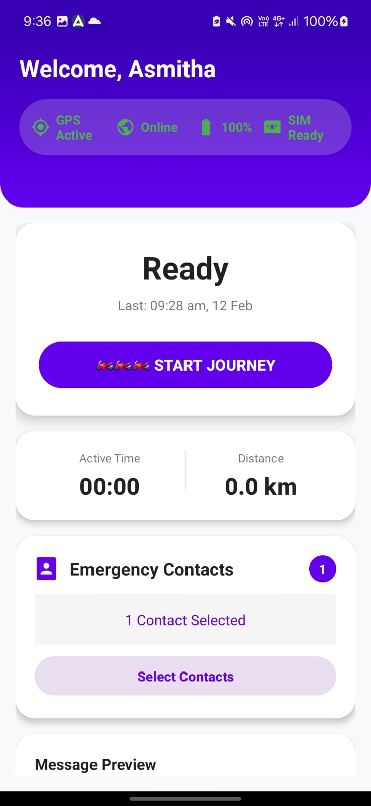

### Journey Details
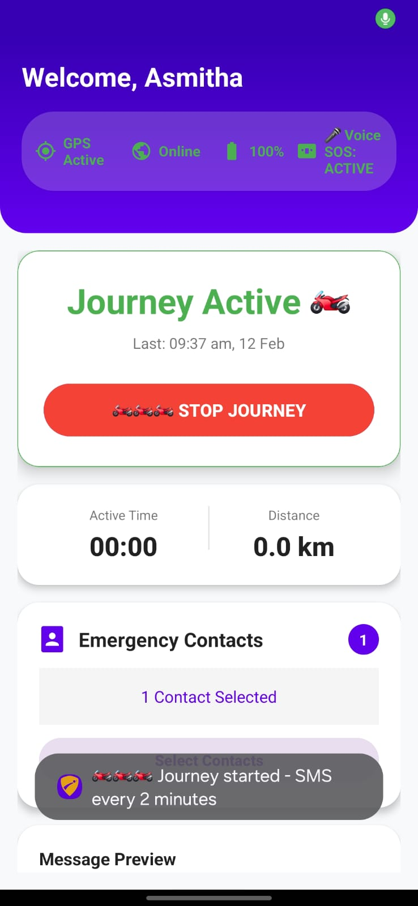

### Journey Detection
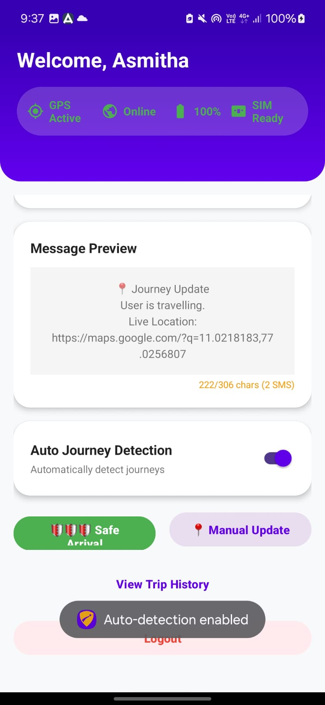

---

## 👥 Emergency Contacts

### Emergency Contacts Selection
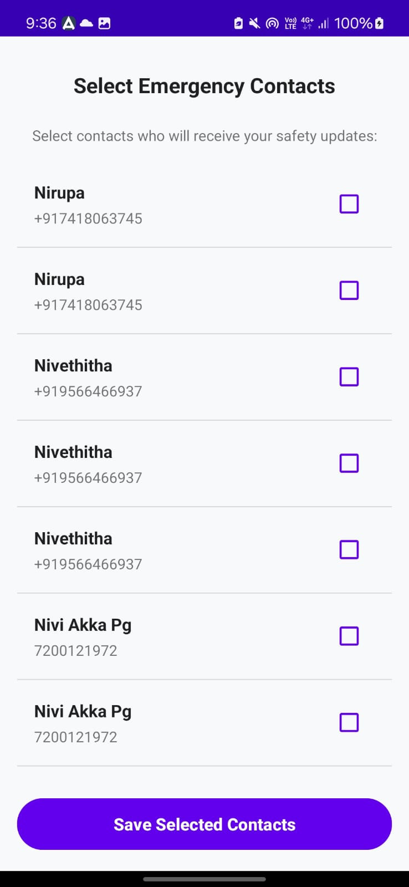

---

## 🚨 SOS & Emergency Alerts

### Emergency SOS Screen
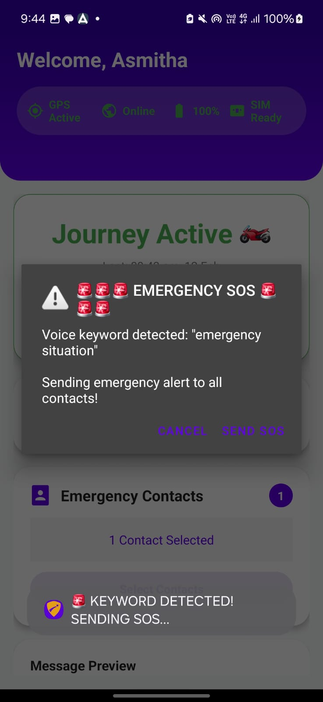

### SOS Using NLP
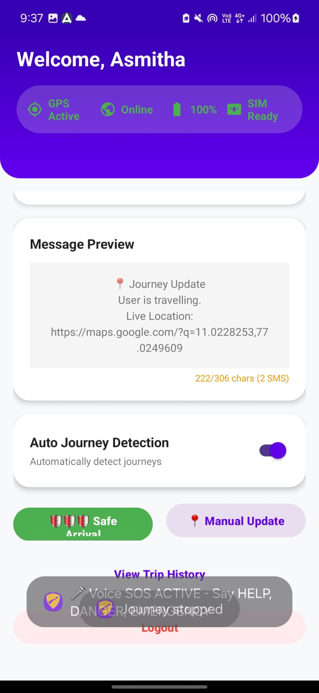

### Speech Detection
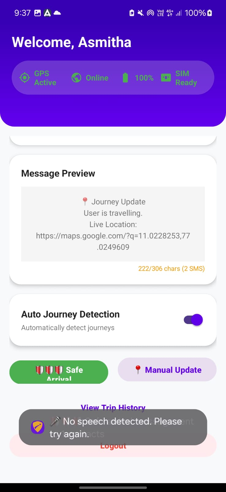

### Voice Permission
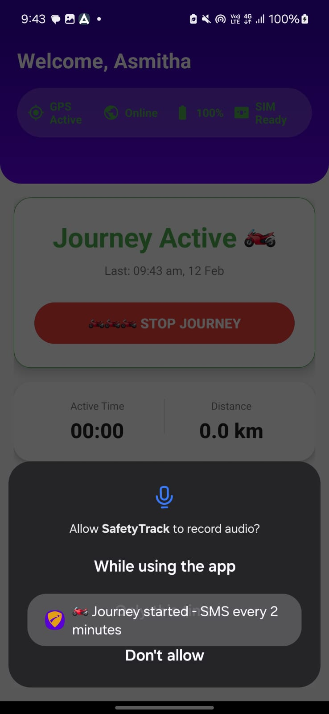

---

## 📩 SMS Notifications

### SOS Received via SMS

### Safe Arrival Notification via SMS

---

# 🎯 Core Innovation

- Automatic real-time location sharing via SMS every 2 minutes during a journey
- Integrated SOS emergency alert system
- Voice-triggered high alert detection

---

# 🧠 Future Enhancements

- Live tracking dashboard for guardians
- Background service optimization
- Advanced NLP threat detection
- AI-based abnormal route detection
- Panic gesture detection
- Cloud-based emergency monitoring system
